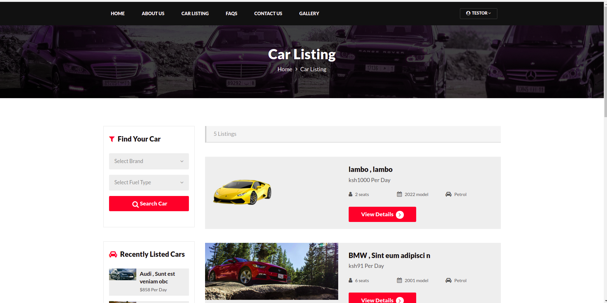

## How to install this project

you need xampp/lampp to run this project .
create a db named `carrental` and import the sql file in your myphpadmin
 
> :warning: **the sql file is in the db directory**

**Admin**

    admin
    Test@12345

**Client**

       register another user and login

## URL links

| Pages       | URL                                  |
| ----------- | ------------------------------------ |
| client page | http://localhost/carrental/index.php |
| admin page  | http://localhost/carrental/admin/    |

## Bugs
**admin bugs**
* delete / edit a car

    `manage-vehicles.php`

**client bugs**

- image display
  `i momentarily fixed this by using images of same size`
- more bugs coming

**missing module**

- multi-user login

> :warning: **i have updated the database**: find the sql file in the db folder!

## Screenshots
  

 
 
 
    

